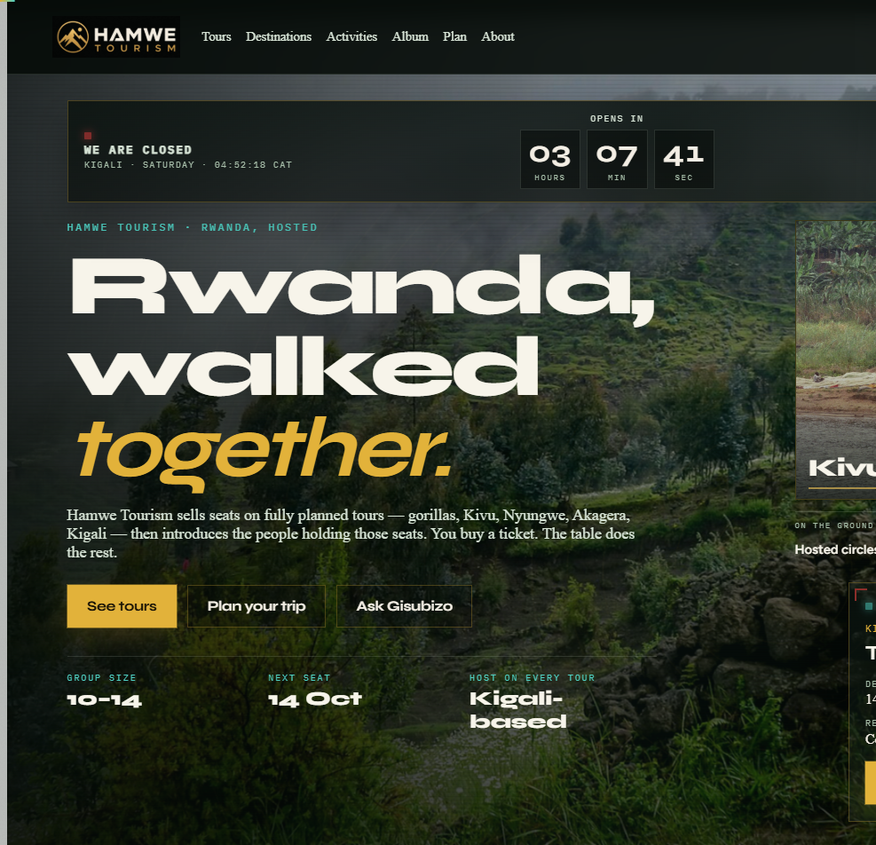
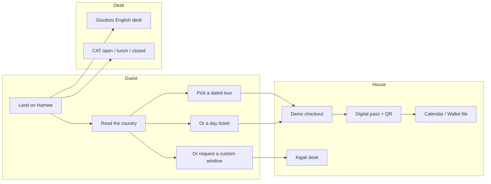
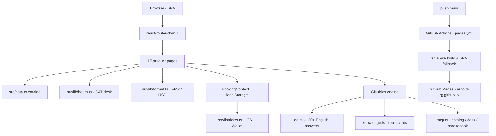
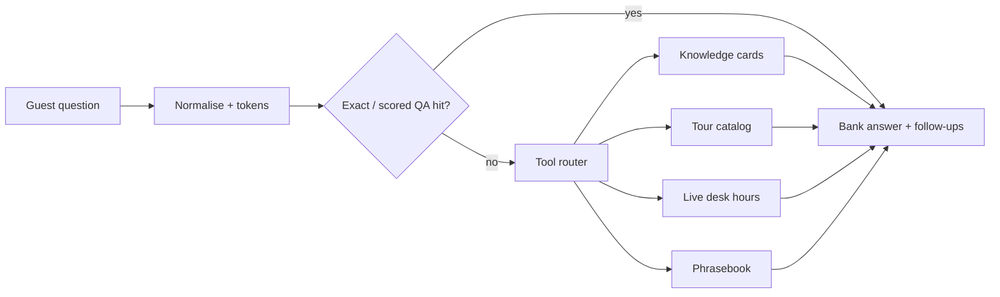
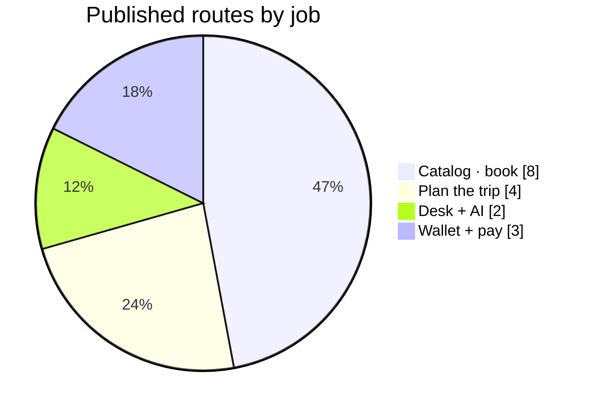
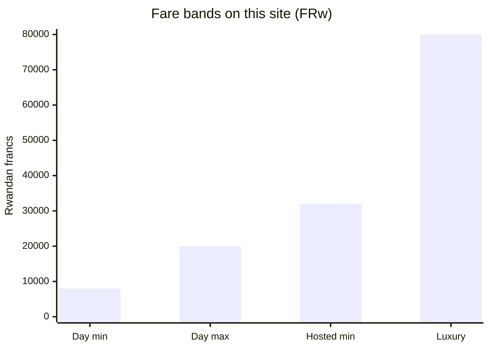

# Hamwe Tourism

Kigali-born travel product. Hosted Rwanda itineraries for small groups — dated seats, a bilingual host, and a table that already has a road.

<p align="center">
  <a href="https://arnold-rg.github.io"></a>
  
  
  
  
</p>

<p align="center">
  <strong><a href="https://arnold-rg.github.io">Open the product</a></strong>
  ·
  <a href="docs/DASHBOARD.md">Engineering dashboard</a>
  ·
  <a href="docs/ARCHITECTURE.md">Architecture</a>
  ·
  <a href="CONTRIBUTING.md">Contribute</a>
</p>



Hamwe means *together*. This repository is the public source for the Hamwe Tourism house: a React 19 + Vite 7 + TypeScript storefront that sells hosted tours and day tickets, keeps a live Kigali desk clock, and answers Rwanda questions in English through Gisubizo.

It is a private travel company site — not [Visit Rwanda](https://www.visitrwanda.com) and not the Rwanda Development Board.

---

## Why this repo exists

Most tourism sites are a brochure with a contact form. Hamwe is a **booking product** with a real operating model:

| Constraint | How it is enforced |
| --- | --- |
| Fares live in Rwandan francs | Display is FRw-first; USD is a locked 1,450 line |
| Day tickets FRw 8,000–20,000 | `ticketFromRwf` clamps the band |
| Luxury ceiling FRw 80,000 | `fareFromRwf` / `LUXURY_PACKAGE_RWF` — no listed unit is higher |
| Office in Kisimenti | Ikaze House, KG 11 Ave · +250 794 607 518 |
| Desk clock is Rwanda time | Fixed CAT UTC+2, no DST guesswork |
| Lunch is not “closed” | 12:00–13:30 is a yellow *on lunch* state |
| Payments are honest | Demo checkout — no live MoMo or card charge |
| Gisubizo is English-only | Local RAG + a 120+ question bank, not a dumped chip wall |

---

## Product surface



| Route | Role |
| --- | --- |
| `/` | Hero, live desk countdown, method, destinations, request |
| `/tours`, `/tours/:slug` | Six hosted itineraries, FRw 32,000–80,000 |
| `/activities`, `/activities/:slug` | Day tickets and extras, FRw 8,000–80,000 |
| `/destinations` | Kigali, Volcanoes, Kivu, Nyungwe, Akagera, Nyanza |
| `/album` | Curated Rwanda photographs |
| `/plan` | Visa, season, packing, money, health |
| `/included` | What the seat buys — and what it does not |
| `/responsible` | Memorials, parks, plastic-bag ban, Umuganda |
| `/contact` | Request a trip |
| `/gisubizo` | English Rwanda desk |
| `/checkout`, `/tickets`, `/ticket/:id` | Demo pay, QR pass, Calendar, Wallet |

`/circles` and `/membership` redirect to `/tours`. Memberships are no longer sold.

---

## System architecture



### Gisubizo — the English desk



---

## Engineering dashboard

Full charts and status live in **[docs/DASHBOARD.md](docs/DASHBOARD.md)**. Snapshot:





| Signal | Value |
| --- | --- |
| Live product | https://arnold-rg.github.io |
| Hosted tours | 6 |
| Day tickets / extras | 16 |
| Destinations on the map | 6 |
| Gisubizo answers | 120+ English |
| Office | Daily 08:00–12:00 ¦ 13:30–18:00 CAT |
| Payments | Demo only |

---

## Stack

| Layer | Choice | Why |
| --- | --- | --- |
| UI | React 19 | Concurrent UI, no extra state library |
| Build | Vite 7 | Fast local loop, simple Pages artifact |
| Types | TypeScript 5.9 | Catalog, tickets, and checkout stay honest |
| Routing | react-router-dom 7 | SPA with GitHub Pages fallback |
| Desk time | CAT UTC+2 arithmetic | Rwanda has no DST |
| Persistence | `localStorage` | Tickets and trip requests stay on-device |
| Ship | GitHub Actions → Pages | `npm ci` · `tsc` · `vite build` · deploy `dist/` |

---

## Repository map

```
src/
  pages/           Product routes
  components/      Lockup, desk, Gisubizo, tickets
  gisubizo/        QA bank, knowledge, tools, engine
  context/         Booking cart + issued tickets
  lib/             FRw math, CAT hours, ICS / Wallet
  data.ts          Tours, extras, destinations, FAQs
public/brand/      Hamwe Tourism lockup
.github/           Pages workflow, templates, README assets
docs/              Architecture + dashboard (GitHub only)
```

The live site is **only** the Vite `dist/` upload. Markdown in this repository is for reviewers on GitHub. It is not added to the product.

---

## Local

```bash
npm install
npm run dev
```

Open `http://localhost:5173`. `npm run build` typechecks and writes the Pages artifact.

---

## Review this like an engineer

Start here, in this order:

1. [`src/lib/hours.ts`](src/lib/hours.ts) — CAT office state machine
2. [`src/lib/format.ts`](src/lib/format.ts) — franc floor and luxury ceiling
3. [`src/gisubizo/engine.ts`](src/gisubizo/engine.ts) — how answers are chosen
4. [`src/App.tsx`](src/App.tsx) — the whole product surface
5. [`.github/workflows/pages.yml`](.github/workflows/pages.yml) — how it ships

Then walk [docs/ARCHITECTURE.md](docs/ARCHITECTURE.md).

---

## House

Ikaze House, KG 11 Ave, Kisimenti, Kigali  
+250 794 607 518 · circle@hamwe.rw

© 2026 Hamwe Tourism. Demo payments. Public source.
