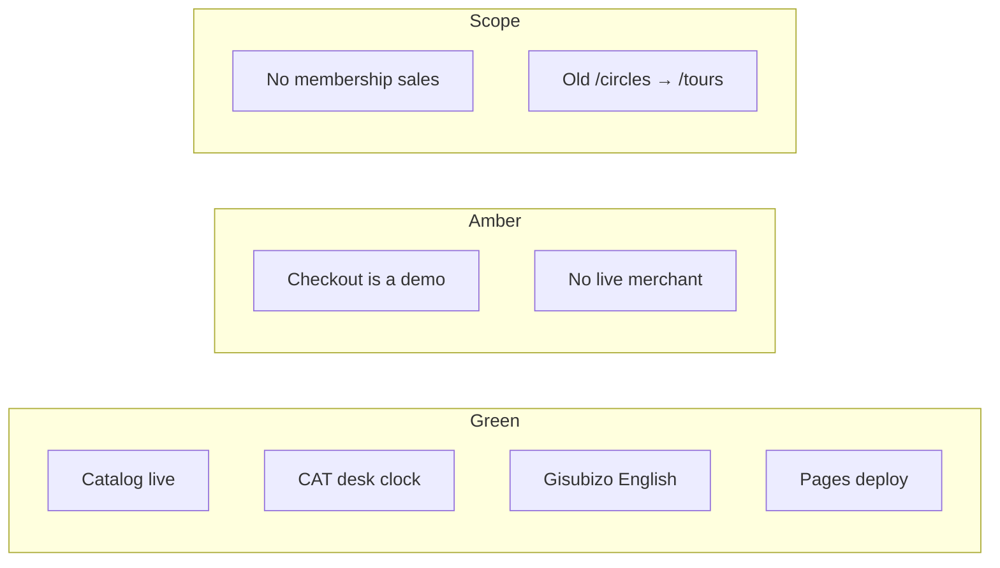
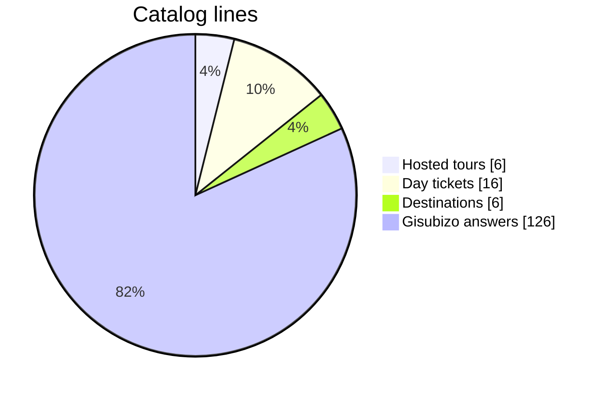
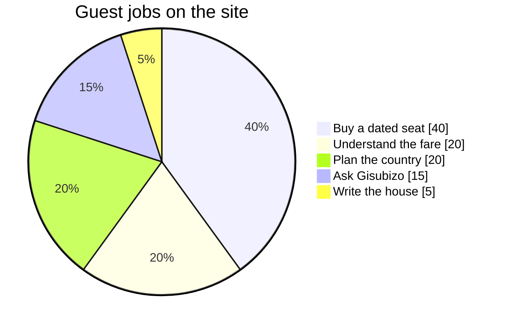
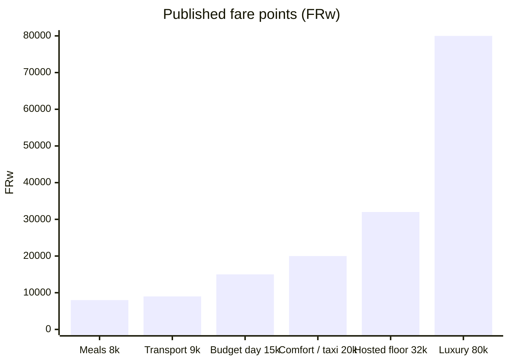
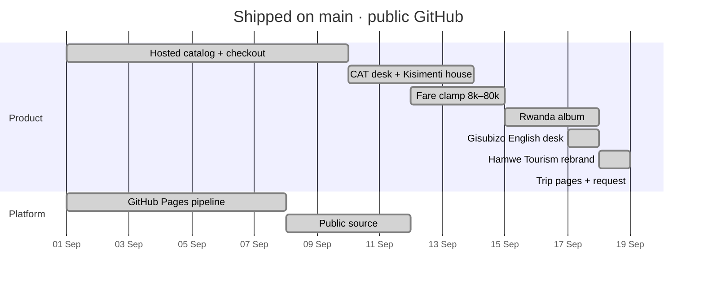
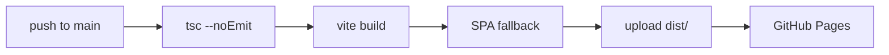

# Hamwe Tourism · engineering dashboard

GitHub-only control room for this repository. Nothing here is mounted in the product.

Live product: **https://arnold-rg.github.io**

---

## Operating status

| System | State | Notes |
| --- | --- | --- |
| Storefront | **Shipped** | 17 pages, lockup reads Hamwe Tourism |
| Hosted tours | **Shipped** | 6 dated itineraries |
| Day tickets | **Shipped** | 16 extras, FRw 8k–20k / luxury 80k |
| Plan / included / care | **Shipped** | Visitor ops a tourism desk should already have |
| Request a trip | **Shipped** | Stored on-device as a demo desk |
| Gisubizo | **Shipped** | 120+ English Q&A + knowledge + tools |
| CAT office radar | **Shipped** | Open / lunch / closed, daily 08:00 |
| Digital pass | **Shipped** | QR, `.ics`, Wallet file |
| Merchant pay | **Demo** | MoMo / QR / card / PayPal UI, no debit |
| Custom domain | **Held** | No CNAME until DNS is owned |

---

## Product mix

---

## Fare architecture

Nothing on the site lists a unit above FRw 80,000. Day tickets stay in the 8–20k band.

| Band | FRw | Used for |
| --- | --- | --- |
| Floor | 8,000 | Cheapest day ticket |
| Day ceiling | 20,000 | Comfortable / taxi day |
| Hosted tours | 32,000–80,000 | Lodge + host packages |
| Luxury | 80,000 | Full Gathering, Virunga Dawn, luxury day |

---

## Delivery timeline

---

## Quality gates

- Typecheck is part of `npm run build`, not optional.
- The Pages workflow deploys **only** `dist/`. README, `docs/`, and `.github/` stay on GitHub for reviewers.
- No live secrets. No merchant keys. Checkout is labelled as a demo in the footer.

---

## Where to look in the code

| Question | File |
| --- | --- |
| Is the desk open in Kigali right now? | `src/lib/hours.ts` |
| Why can a fare not exceed 80k? | `src/lib/format.ts` |
| How does Gisubizo pick an answer? | `src/gisubizo/engine.ts` |
| What tours exist? | `src/data.ts` |
| How does a ticket become an `.ics`? | `src/lib/ticket.ts` |
| What ships to production? | `.github/workflows/pages.yml` |

Deep design notes: [ARCHITECTURE.md](ARCHITECTURE.md).
